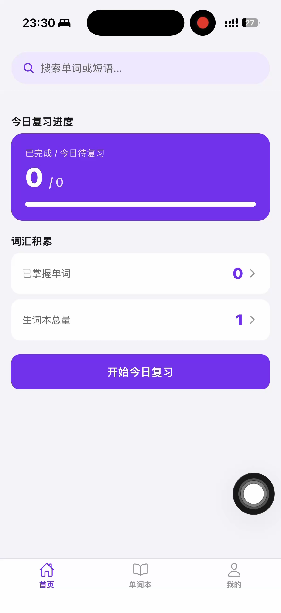
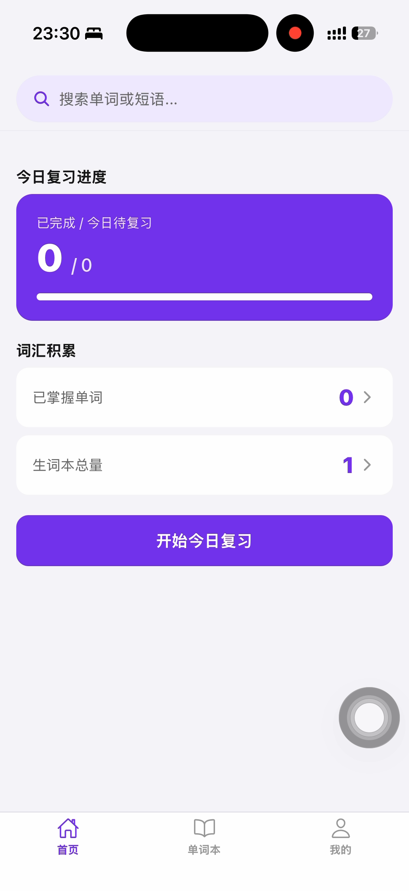
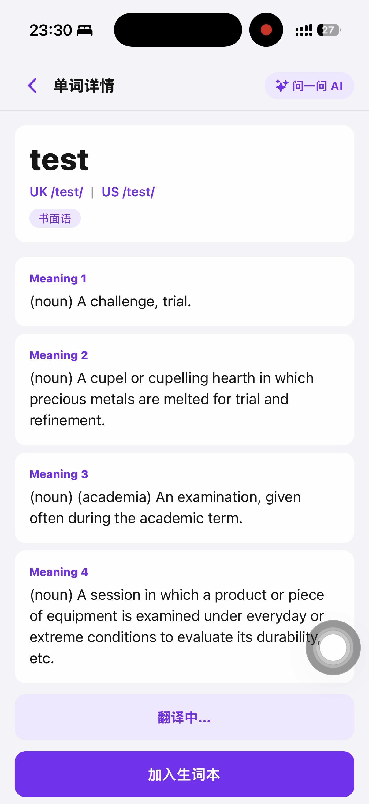
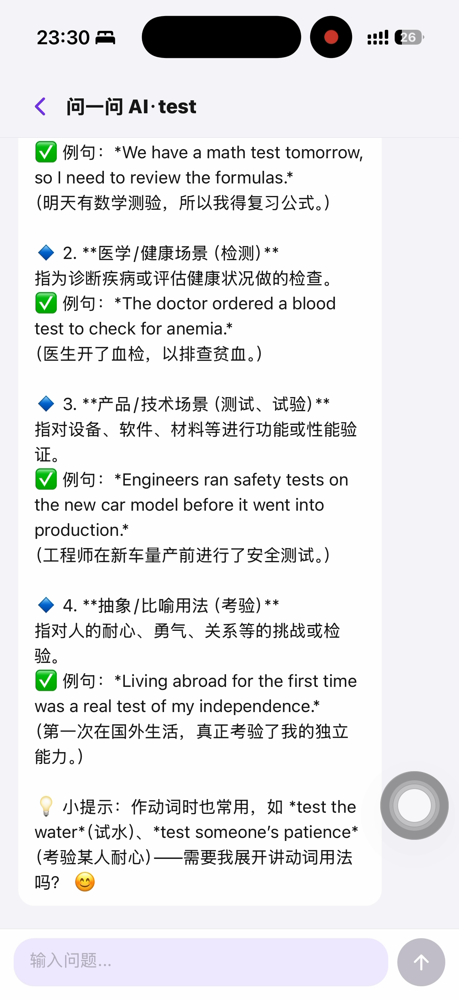
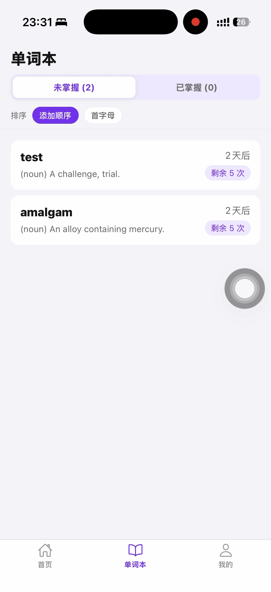

# mumu · 职场英语生词学习 App

> 一款强调「英文沉浸式学习 + 遗忘曲线复习 + AI 驱动查词」的职场英语应用，帮助你在真实工作场景中积累高质量词汇。

---

## 产品截图

| 首页 Dashboard | 查词页面 | 单词详情 |
|:-:|:-:|:-:|
|  |  |  |

| AI 助手对话 | 生词本 |
|:-:|:-:|
|  |  |

---

## 产品定位

区别于传统背单词 App：

- **英文优先**：默认展示英文释义和例句，中文作为辅助信息按需展开
- **真实语境**：释义风格接近牛津学习词典，例句贴近职场场景
- **长期记忆**：系统自动管理遗忘曲线，无需手动安排复习计划
- **AI 驱动**：调用 Qwen 大模型实时生成词义、音标、搭配、例句

---

## 核心功能

### 🔍 AI 查词
- 输入任意英文单词或短语，实时调用 **Qwen LLM** 返回结构化词典数据
- 包含：英美音标（点击播放 TTS 发音）、使用场景标签、常用搭配、多词义释义
- 中文释义默认隐藏，点击展开，帮助建立英文思维

### 📚 生词本
- 一键将查词结果加入生词本
- 展示每个词的下次复习时间、剩余复习轮次

### 🔁 遗忘曲线复习
- 基于间隔重复算法自动安排复习计划（默认间隔：2 / 2 / 3 / 8 / 15 天）
- 复习流程：先展示单词 → 用户判断认识 / 不认识 → 自动调度下次复习
- 支持「撤回上一个」操作，避免误操作
- 全部复习完成后标记为「已掌握」

### 🤖 AI 助手对话
- 针对当前单词发起上下文对话，深入理解用法、辨析近义词
- 内置智能追问建议，降低对话门槛

### 🔔 每日提醒
- 每天 12:00 本地通知，提示待复习单词数量

### ⚙️ 个性化设置
- 复习时是否自动播放发音（默认开启）
- API Key 本地安全存储

---

## 技术栈

| 层级 | 技术 |
|------|------|
| 前端框架 | React Native + Expo |
| 语言 | TypeScript |
| LLM | Qwen（阿里云通义千问） |
| 语音合成 | 系统 TTS（expo-speech）+ 有道 TTS |
| 本地存储 | AsyncStorage |
| 打包发布 | EAS Build（Expo Application Services） |
| AI 辅助开发 | Qoder + Codex |

---

## 快速开始

### 环境要求

- Node.js >= 18
- Expo CLI
- iOS 模拟器 或 Android 模拟器 / 真机

### 安装依赖

```bash
npm install
```

### 配置 API Key

首次启动后，在 App「我的」页面填入你的 **Qwen API Key**（[获取地址](https://dashscope.aliyun.com/)）。

### 启动开发服务器

```bash
npm start
```

### 运行到 iOS

```bash
npm run ios
```

### 运行到 Android

```bash
npm run android
```

---

## 构建发布

项目使用 EAS Build 进行云端编译：

```bash
# Android 预览包
npm run build:android

# Android 生产包
npm run build:android:prod

# OTA 更新
npm run update
```

---

## 项目结构

```
mumu/
├── App.tsx              # 主应用入口，包含所有页面逻辑
├── src/
│   ├── lib/
│   │   ├── qwen.ts      # Qwen LLM 接口封装（查词 + AI 对话）
│   │   ├── dictionary.ts # 查词逻辑
│   │   ├── review.ts    # 遗忘曲线复习算法
│   │   ├── storage.ts   # 本地数据持久化
│   │   └── youdaoTts.ts # 有道 TTS 发音接口
│   ├── theme.ts         # 全局颜色 / 间距规范（紫色系极简风格）
│   └── types.ts         # TypeScript 类型定义
├── assets/              # 图标资源
├── scripts/             # 复习逻辑单元测试脚本
└── app.json             # Expo 配置（含复习间隔参数）
```

---

## 复习算法说明

采用**间隔重复（Spaced Repetition）**：

| 轮次 | 距添加日 | 间隔 |
|------|----------|------|
| 第 1 轮 | 第 2 天 | 2 天 |
| 第 2 轮 | 第 4 天 | 2 天 |
| 第 3 轮 | 第 7 天 | 3 天 |
| 第 4 轮 | 第 15 天 | 8 天 |
| 第 5 轮 | 第 30 天 | 15 天 |

- 点击「认识」→ 进入下一轮，间隔递增
- 点击「不认识」→ 重置为第 1 轮，当次不计进度
- 5 轮全部通过 → 标记为「已掌握」

---

## License

MIT
